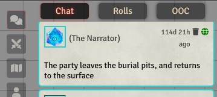

# Tabbed Chatlog for FoundryVTT (v13+)

This is a module for FoundryVTT that separates the chatlog into multiple tabs: Chat, Rolls, and OOC.

# Features:

- 3 tabs: Chat, Rolls, and OOC
- Option to scroll to bottom when switching tabs (default: true)
- Option to send messages with many inline rolls into the rolls tab

# Installation

Install through the FoundryVTT admin interface.

Manifest URL:

- **Latest:** https://github.com/cclloyd/foundryvtt-tabbed-chatlog/releases/download/latest/module.json
- **Specific Version:** https://github.com/cclloyd/foundryvtt-tabbed-chatlog/releases/download/v1.0.1/module.json

# Development

- Clone the repository
- Run `yarn install`
- To build:
    - Run `yarn build`
- To develop:
    - Create a folder named `dist` in the project root.
    - Create a symlink/shortcut from the `dist` folder to your foundry's module directory and name the linked folder
      `fvtt-tabbed-chatlog`
        - Windows default: `%LocalAppData%\FoundryVTT\Data\modules`
        - Linux default: `~/.local/share/FoundryVTT/Data/modules`
        - Recommended: develop in a docker container, mount the `dist` volume to the above destination
    - Run `yarn watch` (this will watch the src directory for changes and automatically rebuild changes live)
    - Launch Foundry

## Prerequisites

In order to build this module, recent versions of `node` (>= 24) and `yarn/npm` are
required. If you don't have `yarn`, but have `npm`, just run `npm install -g yarn` to install `yarn`.
